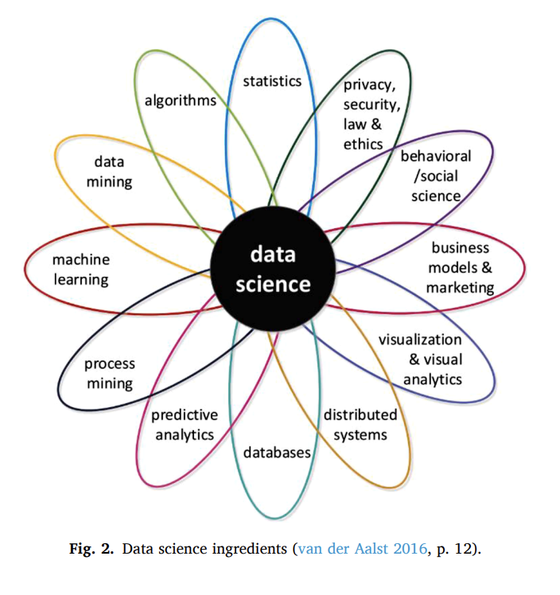

# **We will go as fast as the slowest person in the room!** 🐢➡️🚀

::: {.callout-tip}
## Two rules for the week
1. Ask any question, no matter how "small."
2. If you're confused, **so is the person next to you** — speak up.
:::

---

## 👋 Welcome to the module

Hi! I'm **Catalina Cañizares, Ph.D.** I research mental health and youth risk behavior using data science and machine learning.

By **Thursday** you will have:

- ✅ A working R + Quarto setup
- ✅ A **published Quarto website** about *your* ML project
- ✅ Hands-on experience with **machine learning** in `tidymodels`
- ✅ A real URL you can share with your family, your PI, or your CV 💼

---

## 🗺️ The week at a glance

| Day | Topic | What you'll build |
|-----|-------|-------------------|
| **Mon** | R + Quarto + your project website | The skeleton of your ML website |
| **Tue** | Tidyverse — cleaning real data | Cleaned YRBS data + your *Dataset* page |
| **Wed** | Intro to ML + `tidymodels` + Lasso | Your first trained model — added as a page |
| **Thu** | Trees, Forests, KNN + 🚀 **publish!** | Your full website live online |

::: {.callout-note}
## Bonus
If we fly through everything, we'll add a *Beautiful Tables* mini-session (Taylor Swift edition 🎤). 🤞
:::

---

## 🌟 The deliverable: your own ML project website

By Thursday afternoon, you'll publish a **Quarto website** like this one:

👉 [**ccani007.github.io/machine-learning-project-FAU**](https://ccani007.github.io/machine-learning-project-FAU/)

::: {.incremental}
- 🙋 An *About me* page
- 🧪 A *Dataset & research question* page
- 🤖 One page per ML model you fit (Lasso, Decision Tree, Random Forest, KNN…)
- 🌐 A real, public URL on **Quarto Pub** that you can share
:::

::: {.fragment}
> Today we lay the foundation: **R, Quarto, and the template you'll publish on Thursday**.
:::

---

## 🎯 Objectives for today

::: {.incremental}
- Understand what data science is — and why **R** is a great tool for it.
- Render your **first Quarto document** in under 10 minutes.
- Dissect a Quarto file: **YAML**, **code chunks**, **markup text**.
- Open the **ML project template** on Posit Cloud and understand a **Quarto website**.
- Import data from CSV, Excel, SPSS, and from an R package.
- Explore a dataset and identify **variable types**.
- Pick a research question and write your *About me* + *Dataset* pages.
:::

# 🌎 Introduction to Data Science

## What is Data Science?

Scan this QR code and answer in one word: **"Data science is..."**

{fig-align="center" width="35%"}

::: {.fragment}
We'll come back to your answers in a minute. 👀
:::

---

## Defining Data Science

::: {.incremental}
> Data Science allows you to transform **raw data into understanding, insight, and knowledge**. [@wickham2023r]
:::

::: {.fragment}
**The Data Science Association says:**

- [Data Science]{.mark} — *"the scientific study of the creation, validation and transformation of data to create meaning"*
- [Statistics]{.mark} — *"the practice or science of collecting and analyzing numerical data in large quantities"*
:::

::: {.fragment}
> Academics still disagree on the boundaries between the two. [@hassani2021]
:::

---

## Defining Data Science

{fig-align="center"}

:::footer
[@hassani2021]
:::

---

## Why this matters for *you*

::: {.incremental}
- Almost every health, business, and policy decision is now data-driven.
- The skills you learn this week — **wrangle → visualize → model → communicate** — generalize far beyond R.
- A reproducible workflow is **a career superpower**: your future self (and your PI) will thank you.
:::

# 💻 R, RStudio & Quarto

## Why R?

::: {.columns}
::: {.column width="55%"}
::: {.incremental}
- **Free & open source** — runs on Mac, Windows, Linux.
- **Built for data** — statistics, graphics, and modeling are first-class.
- Used at the **CDC, FDA, BBC, Airbnb, NYT, Pfizer**, and most academic biostats programs.
- Massive ecosystem: ~20,000 packages on CRAN.
- Reproducibility is *baked in* via projects + Quarto.
:::
:::
::: {.column width="45%"}
{fig-align="center"}

:::footer
[@giorgi2022]
:::
:::
:::

---

## R vs. Python vs. SAS — the honest answer

::: {.incremental}
- **R**: best for statistics, visualization, reproducible reporting (👈 us).
- **Python**: best for general-purpose programming and deep learning.
- **SAS**: still common in pharma & FDA submissions.
- *They're all good.* The principles you learn in R transfer.
:::

::: {.fragment}
> The best language is the one your team uses.
:::

---

## How learning R feels at first

{fig-align="center"}

::: {.fragment}
**That's normal.** By Thursday it will feel completely different. 💛
:::

---

## R vs. RStudio vs. Quarto — three different things

| Tool | What it is | Analogy |
|------|------------|---------|
| **R** | The programming language (the *engine*) | The car engine |
| **RStudio / Posit** | The editor where you write R (the *dashboard*) | The driver's seat |
| **Quarto** | The system that turns code + text into reports | The dashcam recording the trip |

::: {.fragment}
*You always need R. RStudio is optional but lovely. Quarto is what makes it reproducible.*
:::

# 🚀 Your First Win: Render Something in 5 Minutes

## Open Posit Cloud ☁️

::: {.columns}
::: {.column width="50%"}
1. Go to [posit.cloud](https://posit.cloud) and create a free account.
2. Click the project link I shared.
3. Click **"Save a permanent copy"** (top right).
4. You'll see RStudio in your browser — same as the desktop version.
:::
::: {.column width="50%"}

:::
:::

::: {.fragment}
> No installs. No path errors. Just code. ✨
:::

---

## Render your first Quarto file

::: {.incremental}
1. In the **Files pane** (bottom-right), click `analysis.qmd`.
2. Find the **Render** button at the top of the editor (it has a blue arrow).
3. Click it.
4. Watch the magic. 🪄
:::

::: {.fragment}
{fig-align="center" width="40%"}
:::

---

## What just happened?

You wrote a mix of **text + R code**, hit one button, and got a **publication-quality HTML report** with formatted tables, plots, and references.

That's Quarto. Let's dissect it. 🔬

# 🔬 Anatomy of a Quarto File

## The 3 ingredients

{fig-align="center"}

::: {.fragment}
1. **YAML header** — settings (title, author, output type)
2. **Code chunks** — R code that gets executed
3. **Markup text** — your words, formatting, citations
:::

# 1️⃣ YAML — the header {background-color="black"}

## What is YAML?

The first lines of every Quarto document. Bounded by **three dashes** above and below.

It tells R *how* to build your report.

```yaml
---
title: "My Awesome Report"
author: "Your Name"
date: today
format: html
bibliography: references.bib
---
```

::: {.callout-tip}
## Indentation matters in YAML
Two spaces per level. **Never tabs.** RStudio's *Visual Editor* (Cmd/Ctrl + Shift + F4) handles it for you.
:::

---

## Same content, different outputs

The *only* thing that changes is the `format:` line.

::: {.columns}
::: {.column width="33%"}
**HTML**

```yaml
format: html
```

{width="80%"}
:::
::: {.column width="33%"}
**Word**

```yaml
format: docx
```

{width="80%"}
:::
::: {.column width="33%"}
**PowerPoint**

```yaml
format: pptx
```

{width="80%"}
:::
:::

::: {.fragment}
> One source file → many output formats. *That's reproducibility.*
:::

# 2️⃣ Code Chunks {background-color="black"}

## Anatomy of a chunk

{fig-align="center"}

::: {.fragment}
A chunk is a block of R code surrounded by ```` ``` ````.
Quarto runs it and inserts the result into your report.
:::

---

## Make chunks like a `pro` ⌨️

| Action | Mac | Windows / Linux |
|--------|-----|-----------------|
| Insert a new chunk | `⌘ + ⌥ + I` | `Ctrl + Alt + I` |
| Run current line | `⌘ + Return` | `Ctrl + Enter` |
| Run whole chunk | `⌘ + ⇧ + Return` | `Ctrl + Shift + Enter` |
| Render the document | `⌘ + ⇧ + K` | `Ctrl + Shift + K` |
| Insert pipe `\|>` | `⌘ + ⇧ + M` | `Ctrl + Shift + M` |

::: {.fragment}
**Pro tip:** name your chunks with [kebab-case]{.mark} (`#| label: fig-penguin-flippers`) — required for cross-references.
:::

---

## Modern chunk options — the `#|` syntax

Quarto uses **hash-pipe** options *inside* the chunk:

```{{r}}
#| label: fig-penguins
#| echo: false
#| message: false
#| warning: false
#| fig-cap: "Penguin flipper lengths by species"

library(palmerpenguins)
plot(penguins$species, penguins$flipper_length_mm)
```

::: {.fragment}
### Top 5 you'll actually use

| Option | What it does |
|---|---|
| `echo: false` | Hide the code, show the result |
| `eval: false` | Show the code, don't run it |
| `message: false` | Suppress chatty package messages |
| `warning: false` | Suppress warnings |
| `fig-cap: "..."` | Add a caption + enable cross-referencing |
:::

---

## Cross-references for free 🔗

Give a chunk a `label:` starting with `fig-` or `tbl-`, then refer to it in text:

```markdown
As shown in @fig-penguins, Gentoos have the longest flippers.
```

Quarto auto-numbers it. **No more manual "Figure 3"** that breaks when you add Figure 2.5.

::: {.callout-note}
## The naming rules
- **Figures** → `fig-something` → `@fig-something`
- **Tables** → `tbl-something` → `@tbl-something`
:::

# 3️⃣ Markup Text {background-color="black"}

## Writing prose around your code

Outside of chunks, you write **plain text** with simple formatting:

::: {.columns}
::: {.column width="50%"}

**Markdown source ✍️**

```markdown
### A heading

**Bold**, *italic*, `code`.

- Bullet 1
- Bullet 2

[A link](https://quarto.org)

> A blockquote.
```
:::
::: {.column width="50%"}

**Rendered output 👀**

### A heading

**Bold**, *italic*, `code`.

- Bullet 1
- Bullet 2

[A link](https://quarto.org)

> A blockquote.

:::
:::


## Callouts — make important things pop ✨

```markdown
::: {.callout-tip}
## A friendly tip
This is the syntax for a callout.
:::
```

::: {.callout-tip}
## A friendly tip
This is the syntax for a callout.
:::

::: {.callout-warning}
## Be careful
You can also use `note`, `important`, `caution`, `warning`.
:::

---

## Inline math + code

You can drop math in with `$...$`:

> The mean is $\bar{x} = \frac{1}{n}\sum x_i$.

And inline R code with `` `r ` ``:

> There are `r nrow(palmerpenguins::penguins)` penguins in the dataset.

::: {.fragment}
**This is the killer feature**: when the data updates, your numbers update. **Automatically.** 🪄
:::

# 🐧 Hands-On Exercise: The Penguins

## Prediction first, code second

{fig-align="center" width="50%"}

::: {.fragment}
**Question:** *Are there differences between the penguin species in flipper length?*

Before we run anything — **write your prediction as a comment** in your script:
```r
# My guess: ___________ has the longest flippers because ___________
```
:::

---

## Step 1 — Install & load

```{r}
#| eval: false
#| code-copy: true
# install once per computer (uses pak — modern, fast)
install.packages("pak")
pak::pak(c("tidyverse", "table1", "palmerpenguins"))

# load every session
library(tidyverse)
library(table1)
library(palmerpenguins)
data("penguins")
```

::: {.fragment}
::: {.callout-tip}
## Why `pak` instead of `install.packages()`?
- ⚡ **Faster** — installs in parallel
- 🧠 **Smarter** — resolves dependencies cleanly, fewer broken installs
- 🌐 **Works for GitHub too**: `pak::pak("user/repo")`

Think of `pak::pak()` as the *modern* way to install R packages.
:::
:::

::: {.fragment}
::: {.callout-warning}
## Install **once per computer**, library **every session**
Comment out the install line after the first successful run; keep `library()` calls at the top of every script.
:::
:::

---

## Step 2 — Make a Table 1

```{r}
#| eval: false
#| code-copy: true
table1(~ flipper_length_mm | species, data = penguins)
```

::: {.fragment}
**Discuss with your neighbor:**

- Were you right?
- Which species has the longest flippers?
- What's the spread (min/max) telling you?
:::

---

## Step 3a — Visualize: just a boxplot

```{r}
#| eval: false
#| code-copy: true
library(ggplot2)

ggplot(penguins, aes(x = species, y = flipper_length_mm)) +
    geom_boxplot()
```

---

## Step 3b — Add the raw points

```{r}
#| eval: false
#| code-copy: true
ggplot(penguins, aes(x = species, y = flipper_length_mm)) +
    geom_boxplot(width = 0.3) +
    geom_jitter(alpha = 0.5, width = 0.2)
```

::: {.fragment}
> Showing individual points reveals the **distribution shape** that boxplots hide.
:::

---

## Step 3c — Color and labels

```{r}
#| eval: false
#| code-copy: true
ggplot(penguins, aes(x = species, y = flipper_length_mm)) +
    geom_boxplot(aes(color = species), width = 0.3, show.legend = FALSE) +
    geom_jitter(
        aes(color = species),
        alpha = 0.5,
        show.legend = FALSE,
        position = position_jitter(width = 0.2, seed = 0)
    ) +
    scale_color_manual(values = c("darkorange", "purple", "cyan4")) +
    labs(
        x = "Species",
        y = "Flipper length (mm)",
        title = "Gentoos have noticeably longer flippers"
    )
```

---

## Step 4 — Render! 🎉

Save your file → click **Render** (or press `⌘/Ctrl + ⇧ + K`).

{fig-align="center" width="40%"}

::: {.fragment}
**Your console will scroll** with messages — that's R doing the work.
:::

---

## 🪄 The reproducible-magic moment

Watch this. In the body of your text, type:

```markdown
There are `r '\u0060r nrow(penguins)\u0060'` penguins in the dataset.
```

After rendering it becomes:

> There are `r nrow(palmerpenguins::penguins)` penguins in the dataset.

::: {.fragment}
Now imagine the dataset is updated next month.
**You don't touch the prose. The number updates automatically.** ✨
:::

---

## 🛟 Help! My render failed

::: {.incremental}
- 🔍 **Read the error in the console**, not the popup. The line number usually tells you where.
- ❓ **YAML problems** are the #1 culprit. Did you indent with 2 spaces? Closing `---`?
- 📦 **Package not installed?** `pak::pak("packagename")` in the console.
- 🪛 **Path wrong?** Are you sure the file lives in `data/` and not the project root?
- 🔄 **Restart R** (Session → Restart R), then try again. Fixes ~30% of weirdness.
- 🤝 **Ask a neighbor.** Then ask me. Then we'll Google together.
:::

# ☕ Break Time

{fig-align="center"}

# 🧱 Building Your Project Website

## Why projects?

::: {.incremental}
- The best advice for working in R: **always work inside a Project (`.Rproj`)**.
- Projects give you:
  - ✅ Reproducibility — paths are *relative* to the project, not your laptop.
  - ✅ Organization — a self-contained folder you can zip, share, or *publish*.
  - ✅ Sanity — no `setwd("C:/Users/cata/Desktop/...")` ever again.
- More on this from the tidyverse team [here](https://www.tidyverse.org/blog/2017/12/workflow-vs-script/).
:::

---

## A single report vs. a *website* 🌐

::: {.columns}
::: {.column width="50%"}
**One Quarto file → one report**

- Great for a paper or a homework
- Lives on your laptop as an `.html` file

```yaml
format: html
```
:::
::: {.column width="50%"}
**Many Quarto files → a website**

- One page per model, dataset, idea
- Has navigation, themes, a public URL
- Perfect for a **portfolio**

```yaml
project:
  type: website
```
:::
:::

::: {.fragment}
> This week we go for the website. 🚀
:::

---

## Meet your ML project template

I've prepared a **Quarto website template** for you in Posit Cloud — `ml-template`. It already has all the pages, the navigation, and the styling. Your job: **fill it in with *your* analysis**.

::: {.incremental}
1. In Posit Cloud, click on **`ml-template`** in your workspace.
2. Click **"Save a permanent copy"** (top-right). Now it's yours.
3. Rename it to something like **`yrbs-project-firstname`**.
4. Open `index.qmd` to see the home page.
:::

::: {.fragment}
::: {.callout-tip}
## What's inside (sneak peek)
- `index.qmd` — your homepage
- `about.qmd` — about you
- `models.qmd` — your research data + model pages
  - `lasso.qmd`, `decision-tree.qmd`, `random-forest.qmd`, `knn.qmd` — one page per model
- `_quarto.yml` — the website's settings (title, navigation, theme)
:::
:::

---

## The magic file: `_quarto.yml`

This file is the **brain of your website** — it tells Quarto which pages exist and how to lay them out.

```yaml
project:
  type: website
  output-dir: docs

website:
  title: "My ML Project — YRBS 2021"
  navbar:
    left:
      - href: index.qmd
        text: Home
      - href: about.qmd
        text: About me
      - href: dataset.qmd
        text: The Dataset
      - text: Models
        menu:
          - href: lasso.qmd
          - href: decision-tree.qmd

format:
  html:
    theme: cosmo
```

::: {.fragment}
> Want a different look? Swap `cosmo` for `flatly`, `minty`, `darkly`, or `sandstone`. See all themes at [bootswatch.com](https://bootswatch.com/). 🎨
:::

---

## Render the whole website

In RStudio you have a new pane — **Build** (top-right corner).

::: {.incremental}
1. Click the **Build** tab.
2. Click **"Render Website"**.
3. RStudio runs every `.qmd` and stitches them together.
4. A preview opens — click around your site! 🎉
:::

::: {.fragment}
::: {.callout-warning}
Your first render can be slow because every page runs from scratch. After that, only the page you change re-renders.
:::
:::

---

## 🚀 Publishing to Quarto Pub (the easy way)

Quarto Pub gives you a **free public URL** for your website in 30 seconds.

```bash
# In the RStudio Terminal pane (not the Console!)
quarto publish quarto-pub
```

::: {.incremental}
1. The first time, it asks you to log in (use your GitHub or email).
2. It builds your site and uploads it.
3. You get a URL like:
   `https://your-username.quarto.pub/yrbs-project-jane`
4. **Share it. With your mom. With your PI. With LinkedIn.** 🌍
:::

::: {.fragment}
> We'll do this together on **Thursday afternoon** once your models are done.
:::

---

## 📰 What about a manuscript-style report?

If later in your career you want to write a *paper* instead of a website, there's a great R package called **[`rUM`](https://raymondbalise.github.io/rUM/)** that scaffolds a Quarto manuscript with NEJM citation style and a methods/results template.

> Different goal, different tool. **For this module, the website is the goal.** 🌐

# 📥 Getting Data Into R

## Where can data come from?

::: {.incremental}
- 📊 **Excel** — `.xlsx`, `.csv`
- 📈 **Statistical software** — `.sav` (SPSS), `.dta` (Stata), `.sas7bdat` (SAS)
- 🌐 **The web** — APIs, GitHub, Google Sheets
- 📦 **R packages** — pre-cleaned teaching datasets (like `palmerpenguins` or `MLearnYRBSS`)
:::

---

## Get the YRBS data

Download from the module GitHub:

1. From [Excel (`.xlsx`)](https://github.com/ccani007/fau_module/blob/main/data/yrbs_2021.xlsx)
2. From [CSV](https://github.com/ccani007/fau_module/blob/main/data/yrbs_2021.csv)
3. From [SPSS (`.sav`)](https://github.com/ccani007/fau_module/blob/main/data/yrbs_2021.sav)
4. Or directly from an R package (next slide)

> Drop the file into your project's `data/` folder.

---

## `rio` — the Swiss-Army Knife for data 🔪

**One function, every format.** No more memorizing `read_csv()` vs `read_excel()` vs `read_spss()`.

```{r}
#| eval: false
#| code-copy: true
pak::pak("rio")
library(rio)

yrbs_csv <- import("data/yrbs_2021.csv")
yrbs_xlsx <- import("data/yrbs_2021.xlsx")
yrbs_sav <- import("data/yrbs_2021.sav")
```

| Extension | What `rio` does |
|---|---|
| `.csv`, `.tsv` | Calls `data.table::fread` |
| `.xlsx` | Calls `readxl::read_excel` |
| `.sav` | Calls `haven::read_sav` |
| `.dta` | Calls `haven::read_dta` |
| `.rds`, `.rda` | Calls `readRDS` / `load` |

::: {.callout-tip}
## Pro tip
Use **`here::here("data", "yrbs_2021.csv")`** instead of typing paths by hand. It always finds the project root, no matter where your script is.
:::

::: {.callout-note}
## In your `ml-template`…
The cleaned project data lives at **`models/data/analysis_data.rds`**, so you'll load it like this:
```r
analysis_data <- import("models/data/analysis_data.rds")
```
:::

---

## Loading data from a package 📦

Some datasets ship **inside R packages** — no file paths, same data on every laptop. A great example for biostats is [`medicaldata`](https://higgi13425.github.io/medicaldata/) by Peter Higgins, full of real clinical datasets.

```{r}
#| eval: false
#| code-copy: true
pak::pak("medicaldata")
library(medicaldata)

# A few datasets to explore:
data("indo_rct") # RCT to prevent post-ERCP pancreatitis
data("covid_testing") # Pediatric COVID testing data
data("strep_tb") # Streptomycin for TB — from 1948! 🕰️

glimpse(indo_rct)
```

::: {.fragment}
::: {.callout-tip}
## Why this is great
- ✅ No file paths to worry about
- ✅ Same data on every laptop, every render
- ✅ Reproducible — anyone with the package gets identical results
:::
:::


# 🔎 Exploring Your Data

## Three ways to look at a dataset

| When you want… | Use | Returns |
|---|---|---|
| A **quick peek** | `glimpse()` | column names, types, first few values |
| A **full profile** | `skimr::skim()` | distributions, missingness, summary stats |
| A **publication-ready summary** | `gtExtras::gt_plt_summary()` | beautiful HTML table with mini-plots |

---

## 1. The classic peek

```{r}
#| eval: false
library(dplyr)
library(rio)

analysis_data <- import("models/data/analysis_data.rds")
glimpse(analysis_data)
```

{fig-align="center" width="70%"}

---

## 2. The detailed profile

```{r}
#| eval: false
# pak::pak("skimr")
library(skimr)
skim(analysis_data)
```

::: {.fragment}
> `skim()` shows you, at a glance: % missing, mean, sd, distribution, and even a tiny histogram. *Use it on every new dataset.*
:::

---

## 3. The "impress your PI" version

```{r}
#| eval: false
# pak::pak("gtExtras")
library(gtExtras)
library(rio)

# Your ml-template ships with the cleaned YRBS data here:
analysis_data <- import("models/data/analysis_data.rds")

analysis_data |>
    select(
        Age,
        Grade,
        UnsafeAtSchool,
        GunCarrying,
        AttackedInNeighborhood,
        ForcedSexualIntercourse,
        SuicideIdeation
    ) |>
    gt_plt_summary()
```

::: {.callout-note}
## Adjust to *your* variables
The columns above are an example. Use `glimpse(analysis_data)` to see what's in your dataset and pick the variables that matter for your research question.
:::

::: {.fragment}
> 📊 You'll learn way more about `gt`-family tables in **Session 2**.
:::

---

## Variable types in R

{fig-align="center"}

::: {.fragment}
You can check any variable's type:

```{r}
#| eval: false
class(penguins$species) # "factor"
class(penguins$flipper_length_mm) # "numeric"
is.numeric(penguins$year) # TRUE
```
:::

::: {.fragment}
> Why does this matter? Because models care a *lot*: a number is a quantity, a factor is a category. We'll lean on this all week.
:::

# 🤝 How to Get Help (You Will Need It)

## When you're stuck — in this order

::: {.incremental}
1. 📖 **`?function_name`** in the console — the official help page.
2. 🔎 **`??keyword`** — search across all installed packages.
3. 📚 **Package website** — google `packagename tidyverse pkgdown`. Most have one.
4. 🤖 **Ask Cursor / ChatGPT / Copilot** — paste the error, ask "why?"
5. 🌐 **Posit Community Forum** — <https://forum.posit.co/>
6. 💬 **Stack Overflow** — search before asking; tag with `[r]` and `[quarto]`.
7. 🤝 **A neighbor or me.** Always.
:::

---

## A grown-up word about AI tools 🤖

::: {.incremental}
- AI is **fantastic** at: explaining errors, generating boilerplate, suggesting tidyverse alternatives.
- AI is **bad** at: knowing your data, doing real statistics, *learning for you*.
- This week: use AI to **understand**, not to **skip** typing.
- If you copy-paste code, **read it line by line and rewrite a comment in your own words**.
:::

::: {.fragment}
> Goal: by Thursday, you can read R code without your AI on. That's when it sticks.
:::

# 📝 Your Turn

## Start filling in *your* website

::: {.columns}
::: {.column width="55%"}
In your copy of `ml-template`:

::: {.incremental}
1. **Edit `_quarto.yml`** — change the website title to something like *"YRBS 2021 — Jane Doe's ML Project"*.
2. **Open `about.qmd`** — write a short bio: who you are, what you study, why you're here.
3. **Open `dataset.qmd`** and:
   - Load the data: `analysis_data <- rio::import("models/data/analysis_data.rds")`
   - Explore it with `glimpse()` and `skim()`.
   - **Pick 3–5 variables** that interest you (e.g., bullying, sleep, mental health).
   - **Write 1–2 paragraphs** explaining your **research question** and *why* these variables matter for youth health.
4. **Render the website** (Build → Render Website).
:::
:::
::: {.column width="45%"}

:::
:::

# 🎁 Wrapping Up

## What you learned today

::: {.incremental}
- ✅ What R, RStudio, and Quarto each do.
- ✅ How to render a reproducible report.
- ✅ The anatomy of a Quarto file: YAML, chunks, markup.
- ✅ The difference between a single Quarto report and a Quarto **website**.
- ✅ How to use the `ml-template` to scaffold your project.
- ✅ Three ways to import data and three ways to explore it.
- ✅ Why variable types matter.
:::

---

## Before next session 📋

::: {.incremental}
1. **Finish your *About me* and *Dataset* pages.**
2. **Render the website successfully** at least once (even if it's ugly — that's fine).
3. **Decide your research question**: what are you trying to *predict* or *understand*?
4. **Skim** the [tidyverse cheatsheet](https://rstudio.github.io/cheatsheets/data-transformation.pdf).
5. **Bring your laptop charged.** Tomorrow we wrangle. 💪
:::

---

## 📚 Want to keep learning?

- 📘 [R for Data Science (free)](https://r4ds.hadley.wickham.co.nz/)
- 🌐 [Quarto Websites guide](https://quarto.org/docs/websites/)
- 🚀 [Publishing on Quarto Pub](https://quarto.org/docs/publishing/quarto-pub.html)
- 🎨 [Bootswatch themes](https://bootswatch.com/) — change your site's look in one line
- 🖼️ [Quarto Gallery](https://quarto.org/docs/gallery/) — see what's possible
- 🎥 [Julia Silge's screencasts](https://www.youtube.com/@JuliaSilge)
- 📄 [Posit cheatsheets](https://posit.co/resources/cheatsheets/)
- 📰 [TidyTuesday — a new dataset every week](https://github.com/rfordatascience/tidytuesday)

{fig-align="center" width="20%"}

---

## See ya next time! 👋

{fig-align="center"}

## References
